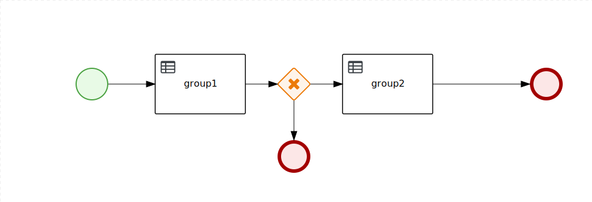

Rule Flow usage example
=======================

This sample project shows the how to use the rule-flow to orchestrate DRL rules.

Rule flow are BPMN model that contains rule tasks.

In `src/test/java/com/myspace/ruleflow/Test.java` the test code to start a rule flow and get back the results.